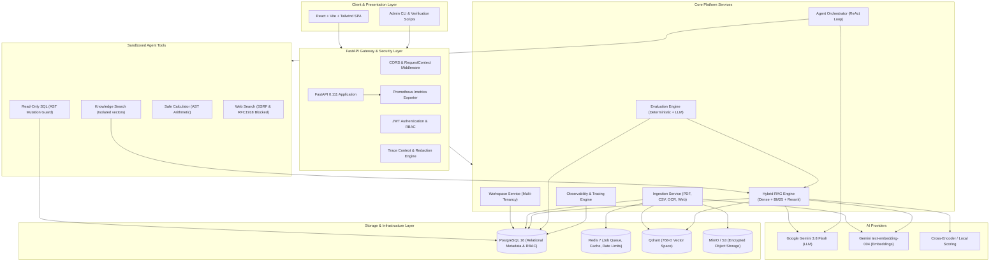

# IntelligenceOS

> **Enterprise-Grade AI Operating System, Grounded Hybrid RAG, Autonomous Multi-Tool Agent Orchestration, Deterministic Evaluation, and Deep Observability Platform.**

[](https://www.python.org/)
[](https://fastapi.tiangolo.com/)
[](https://react.dev/)
[](https://qdrant.tech/)
[](https://www.postgresql.org/)
[](https://redis.io/)
[](LICENSE)

---

## 1. What is IntelligenceOS?

**IntelligenceOS** is an end-to-end, multi-tenant AI operating platform built for mission-critical enterprise applications. Rather than a naive wrapper around an LLM API, IntelligenceOS provides a hardened engineering architecture that addresses the core challenges of production AI systems:

1. **Groundedness & Truthfulness**: Answers are synthesised exclusively from verified workspace documents with exact, clickable citations; unsupported speculation and hallucination are actively rejected.
2. **Deterministic Evaluation**: Regression testing for AI using mathematical metrics (Recall@K, MRR, nDCG@K, Citation F1) benchmarked against explicit ground truth rather than circular LLM judge hallucinations.
3. **Multi-Tenant Isolation**: Strict logical data isolation across relational tables, Qdrant vector spaces, S3 object paths, and tracing spans, backed by Role-Based Access Control (RBAC).
4. **Sandboxed Agent Tooling**: Autonomous multi-step ReAct orchestration with strict step budgets, AST-enforced SQL mutation blockers, sandboxed arithmetic calculation, and SSRF-protected web browsing.
5. **Deep Request Observability**: Hierarchical OpenTelemetry-compatible distributed spans tracking every operation (`request` → `retrieval` → `reranking` → `llm` → `tool_execution` → `response`) with automatic redaction of sensitive credentials, alongside Prometheus metrics export.
6. **Full-Stack Production Ready**: Modern React 18 / TypeScript SPA dashboard served directly by FastAPI or Nginx, with turnkey Docker Compose and Kubernetes manifests.

---

## 2. Global Architecture



### ASCII Architecture

```
+-------------------------------------------------------------------------+
|                   IntelligenceOS Frontend (React / Vite)                |
+-------------------------------------------------------------------------+
                                    |
                                    v [HTTP / JSON]
+-------------------------------------------------------------------------+
|                     FastAPI Application Gateway                         |
|  - RequestContextMiddleware (Trace propagation, timing, headers)        |
|  - CORSMiddleware (Configurable origins)                                |
|  - Prometheus Metrics Exporter (/metrics)                               |
|  - Strict Multi-Tenant RBAC Authorization                               |
+-------------------------------------------------------------------------+
        |                  |                 |                  |
        v                  v                 v                  v
+---------------+  +---------------+  +---------------+  +---------------+
| Ingestion &   |  | RAG Engine    |  | Agent Studio  |  | Evaluation &  |
| Parsers       |  | (Dense+BM25)  |  | (ReAct Loop)  |  | Observability |
+---------------+  +---------------+  +---------------+  +---------------+
        |                  |                 |                  |
        |                  |          +------+------+           |
        |                  |          |             |           |
        |                  |       [Tools]     [LLM Call]       |
        |                  |     - Knowledge   Gemini 3.8       |
        |                  |     - SQL AST     Flash            |
        |                  |     - Calculator                   |
        |                  |     - Web Search                   |
        |                  |          |                         |
        +------------------+----------+-------------------------+
                                   |
                                   v
+-------------------------------------------------------------------------+
|                         Infrastructure Layer                            |
|  ├── PostgreSQL (Relational schema, users, workspaces, traces, evals)   |
|  ├── Redis (Async job queues, locks, rate limits)                       |
|  ├── Qdrant (HNSW vector indices, filtered partitioned collections)     |
|  ├── MinIO / S3 (Raw documents, parsed assets)                          |
|  └── AI Providers (Gemini LLM & Embeddings / Cross-Encoder Rerankers)   |
+-------------------------------------------------------------------------+
```

---

## 3. Technology Stack

| Layer | Technology | Purpose |
|---|---|---|
| **API Framework** | FastAPI 0.111 / Uvicorn | Async ASGI high-performance REST API |
| **Language & Runtime** | Python 3.12 / Node.js 24 | High-throughput asynchronous backend & typed tooling |
| **Relational Database** | PostgreSQL 16 + asyncpg | Multi-tenant identity, RBAC, conversations, traces, eval storage |
| **ORM & Migrations** | SQLAlchemy 2.0 Async + Alembic | Declarative database schema, connection pooling, typed models |
| **Vector Database** | Qdrant v1.9 | HNSW vector indices, partitioned by workspace payload filters |
| **Message Broker** | Redis 7 | Asynchronous document ingestion queue, distributed locks |
| **Object Storage** | MinIO / S3-compatible | Encrypted blob store for raw PDF, CSV, images, and HTML |
| **AI LLM & Embeddings** | Google Gemini 3.8 Flash & text-embedding-004 | High-speed grounded inference, structured outputs, 768-D vectors |
| **Reranking** | Cross-Encoder / Local Scorer | Query-document interaction re-scoring for top-K candidates |
| **Frontend SPA** | React 18, Vite 5, Tailwind CSS, Lucide | Production dashboard, RAG chat, Agent studio, Evaluation lab |
| **Observability** | Prometheus client + Custom Tracer | In-memory span recording, credential redaction, `/metrics` export |
| **Containers & Orchestration** | Docker, Docker Compose, Kubernetes | Containerized local execution and cloud-native scalable manifests |

---

## 4. Major Capabilities by Phase

### Phase 1: Foundation & Identity Layer
- **Modular Monolith**: Clean architecture separating domain models, schemas, services, and API routers.
- **JWT Authentication**: Secure bcrypt password hashing, token issuance, and expired session handling.
- **Workspace Multi-Tenancy**: Organization and workspace isolation with RBAC (`owner`, `admin`, `member`, `viewer`).
- **Health Probes**: Kubernetes-native liveness (`/health/live`) and readiness (`/healthz`) endpoints probing PostgreSQL and Redis.

### Phase 2: Ingestion & Knowledge Extraction Pipeline
- **Multi-Format Parsers**: PDF extraction with page mapping, CSV tabular row serialization, HTML scraping with SSRF filtering, and image OCR with Tesseract.
- **Deterministic Chunking**: Recursive text chunker preserving character offsets, token counts, and chunk index sequences.
- **Background Worker**: Asynchronous queue processing via Redis ensuring non-blocking API operations.
- **Object & Vector Storage**: S3/MinIO raw binary retention and Qdrant vector indexing with workspace partitioning.

### Phase 3: Grounded RAG, Hybrid Retrieval & Citations
- **Hybrid Retrieval**: Merges dense semantic cosine similarity with lexical BM25 keyword matching via Reciprocal Rank Fusion (RRF).
- **Secondary Reranking**: Re-orders retrieved candidates using cross-encoder relevance scoring before context injection.
- **Token Budget Guard**: Strictly limits context to `RAG_MAX_CONTEXT_CHARS` to prevent context pollution and overflow.
- **Traceable Citations**: Grounded answers extract precise source citations (source name, document version, page number, snippet).
- **Privacy Enforcement**: Assistant answers never leak hidden system chain-of-thought or internal scratchpads.

### Phase 4: Autonomous Agent & Sandboxed Tool Orchestration
- **ReAct Loop Orchestrator**: Multi-step reasoning and action loop executing autonomous goals within configurable step budgets.
- **AST-Protected SQL Tool**: Read-only SQL queries validated via SQLGlot AST; mutations (`INSERT`, `UPDATE`, `DELETE`, `DROP`, `ALTER`) and sensitive system tables are blocked.
- **Safe Calculator**: Evaluates arithmetic expressions strictly through SymPy AST; arbitrary code execution is impossible.
- **SSRF-Protected Web Search**: Real-time web fact-finding with loopback and private RFC1918 IP address blocking.
- **Sanitized Execution Trace**: Logs tool execution sequences, status, durations, safe inputs, and outputs without exposing private chain-of-thought.

### Phase 5: Evaluation & Observability Layer
- **Deterministic Retrieval Metrics**: Exact ground-truth computation of Recall@K, MRR (Mean Reciprocal Rank), and nDCG@K.
- **Citation Evaluation**: Computes deterministic citation precision, recall, and F1 against known supporting chunks.
- **Isolated Answer Evaluator**: Distinct evaluation interface separating deterministic heuristics from LLM-based judges.
- **Experiment A/B Comparison**: Answers *"What changed between experiment A and experiment B?"* with metric deltas and config diffs.
- **Lightweight Request Tracing**: ContextVar-propagated spans tracking `request` → `retrieval` → `reranking` → `llm` → `tool` → `response`.
- **Credential Redaction**: Automatic scrubbing of passwords, JWT tokens, API keys, and sensitive documents from logs and traces.
- **Prometheus Metrics**: Standard `/metrics` exporter recording request latencies, throughput, error rates, and tool failures.

### Phase 6: Frontend, Production Hardening & Deployment
- **Interactive Web UI**: Modern React + Vite dashboard covering Dashboard, Knowledge Base, RAG Chat, Agent Studio, Evaluation Lab, and Traces.
- **Unified Single-Binary Serving**: Built frontend assets (`frontend/dist`) are mounted and served directly by FastAPI at `/` for zero-friction local execution, alongside independent Vite dev server support.
- **Security Hardening**: CORS middleware, 20MB upload limits, SSRF guards, input sanitization, and zero-leakage error handling.
- **Turnkey Deployment**: Ready-to-use Docker Compose configuration and complete production Kubernetes manifests in `k8s/`.

---

## 5. Local Setup & Quickstart

### Prerequisites
- Python 3.12+
- Node.js 20+ and npm 10+
- Docker & Docker Compose (optional for full containerized stack)

### 1. Clone & Configure Environment
```bash
git clone https://github.com/your-org/intelligence-os.git
cd intelligence-os

# Create and populate environment variables
cp .env.example .env
```

### 2. Python Environment Setup
```bash
# Create virtual environment
python -m venv .venv

# Activate virtual environment
# Windows:
.venv\Scripts\activate
# Linux/macOS:
source .venv/bin/activate

# Install dependencies in editable mode
pip install -e ".[dev]"
```

### 3. Build Frontend Assets
```bash
cd frontend
npm install
npm run build
cd ..
```

### 4. Run the Application
With the frontend built, FastAPI serves both the complete API and the web UI:
```bash
# Start backend API (and embedded frontend)
uvicorn app.main:app --host 0.0.0.0 --port 8000 --reload

# Start background ingestion worker
python -m app.worker
```

Open your browser at:
- **Web Dashboard**: [http://localhost:8000](http://localhost:8000)
- **Interactive Swagger Docs**: [http://localhost:8000/docs](http://localhost:8000/docs)
- **ReDoc Documentation**: [http://localhost:8000/redoc](http://localhost:8000/redoc)
- **Prometheus Metrics**: [http://localhost:8000/metrics](http://localhost:8000/metrics)

---

## 6. Environment Variables Reference

| Variable | Default Value | Description |
|---|---|---|
| `ENVIRONMENT` | `development` | Runtime environment (`development`, `production`, `testing`) |
| `SECRET_KEY` | *(32+ characters)* | JWT signing secret key (minimum 32 chars) |
| `ALGORITHM` | `HS256` | JWT signature algorithm |
| `ACCESS_TOKEN_EXPIRE_MINUTES`| `60` | JWT bearer token lifespan |
| `CORS_ORIGINS` | `*` | Allowed CORS origins for web clients |
| `POSTGRES_SERVER` | `localhost` | PostgreSQL host |
| `POSTGRES_PORT` | `5432` | PostgreSQL port |
| `POSTGRES_USER` | `intelligenceos` | PostgreSQL username |
| `POSTGRES_PASSWORD` | `intelligenceos_secret` | PostgreSQL password |
| `POSTGRES_DB` | `intelligenceos` | PostgreSQL database name |
| `REDIS_URL` | `redis://localhost:6379/0` | Redis connection URL |
| `STORAGE_BACKEND` | `s3` | Object storage engine (`s3`, `local`, `mock`) |
| `S3_ENDPOINT_URL` | `http://localhost:9000` | S3 / MinIO API endpoint |
| `S3_ACCESS_KEY` | `minioadmin` | S3 access key |
| `S3_SECRET_KEY` | `minioadmin` | S3 secret key |
| `S3_BUCKET_NAME` | `intelligenceos-sources`| Target S3 bucket for sources |
| `QDRANT_HOST` | `localhost` | Qdrant vector database host |
| `QDRANT_PORT` | `6333` | Qdrant HTTP port |
| `QDRANT_COLLECTION` | `intelligenceos_chunks` | Primary vector collection |
| `LLM_PROVIDER` | `gemini` | LLM inference provider (`gemini`, `mock`) |
| `GEMINI_API_KEY` | *(Secret)* | Google Gemini API key |
| `GEMINI_MODEL` | `gemini-3.8-flash` | Gemini model name |
| `EMBEDDING_PROVIDER` | `gemini` | Embedding provider (`gemini`, `mock`) |
| `GEMINI_EMBEDDING_MODEL` | `text-embedding-004` | Embedding model name (768-D) |
| `RAG_RETRIEVAL_MODE` | `hybrid` | Default retrieval strategy (`semantic`, `hybrid`) |
| `RAG_ENABLE_RERANKING`| `true` | Apply cross-encoder reranking |
| `AGENT_MAX_STEPS` | `6` | Maximum tool execution budget per agent query |

---

## 7. Running Test Suites

IntelligenceOS includes a comprehensive, multi-layer automated test suite:

```bash
# Run complete test suite (93+ tests)
pytest tests/ -v

# Run Phase 6 End-to-End integration test specifically
pytest tests/test_e2e_integration.py -v

# Run code style and lint verification
ruff check app/ tests/
```

---

## 8. Deployment Options

### Option A: Docker Compose (Single Host / Local Production)

Run the entire cluster with a single command:
```bash
docker compose up --build -d
```
This provisions:
- `intelligenceos-postgres`: PostgreSQL 16 database
- `intelligenceos-redis`: Redis 7 message queue & cache
- `intelligenceos-qdrant`: Qdrant vector store
- `intelligenceos-minio`: MinIO S3-compatible storage
- `intelligenceos-api`: FastAPI backend on port 8000
- `intelligenceos-worker`: Background ingestion worker
- `intelligenceos-frontend`: Nginx serving the React SPA on port 3000

### Option B: Kubernetes (Cloud-Native Production)

Declarative, cloud-ready manifests are located in `k8s/`:

```bash
# 1. Apply namespace
kubectl apply -f k8s/namespace.yaml

# 2. Apply ConfigMap and Secrets (update secrets with your production keys)
kubectl apply -f k8s/configmap.yaml
kubectl apply -f k8s/secret.yaml

# 3. Deploy infrastructure services
kubectl apply -f k8s/postgres.yaml
kubectl apply -f k8s/redis.yaml
kubectl apply -f k8s/qdrant.yaml
kubectl apply -f k8s/minio.yaml

# 4. Deploy application workloads
kubectl apply -f k8s/api-deployment.yaml
kubectl apply -f k8s/worker-deployment.yaml
kubectl apply -f k8s/frontend-deployment.yaml

# 5. Apply Ingress
kubectl apply -f k8s/ingress.yaml

# Or apply all at once using Kustomize:
kubectl apply -k k8s/
```

---

## 9. Recommended Demonstration Flow

1. **Access Web UI**: Navigate to `http://localhost:8000/`.
2. **Register & Create Workspace**: Create an administrator account and set up a workspace (e.g., *"Acme Research Lab"*).
3. **Ingest Knowledge**: In the **Knowledge Base** tab, upload a document (PDF, CSV, or Image) or crawl a public URL. Watch background processing transition the source to `Indexed`.
4. **Inspect Chunks**: Click the eye icon next to the source to inspect the extracted text chunks, token count, and page numbers.
5. **Ask Grounded Question**: In **RAG Chat**, ask a question answered by your document. Observe the generated response with clickable citations `[1]`, `[2]` and latency telemetry.
6. **Execute Agent Tasks**: In **Agent Studio**, prompt the agent with a multi-step problem:
   *"Calculate 15% tax on 450,000 using calculator and check knowledge base for audit rules."*
   Examine the step-by-step sanitized execution trace.
7. **Run Evaluation Benchmark**: In **Evaluation Lab**, select the benchmark dataset and trigger an experiment comparing **Baseline Semantic** vs. **Improved Hybrid + Reranked**.
8. **Compare Experiments**: Use the Experiment Comparison tool to view the exact delta in Recall@5, MRR, nDCG, and Citation F1.
9. **Inspect Traces & Metrics**: In **Observability**, inspect the end-to-end span waterfall and query `/metrics` to view Prometheus telemetry.
