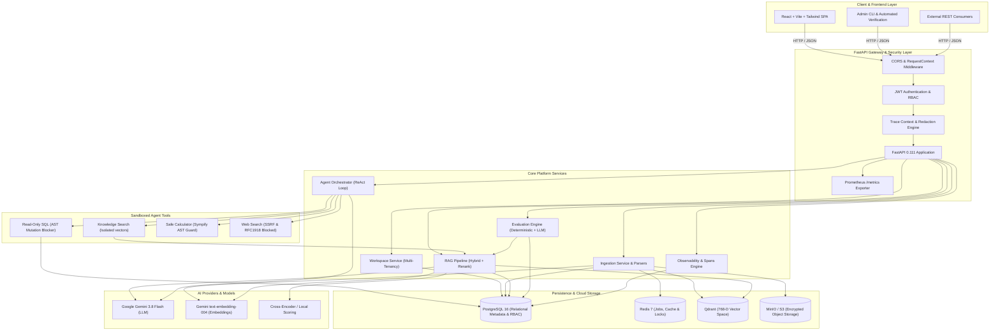

# IntelligenceOS — System Architecture & Design Specification

## 1. Executive Summary

**IntelligenceOS** is an enterprise-grade AI Operating System and RAG platform designed for high-assurance retrieval, autonomous agent orchestration, deterministic evaluation, and deep request observability. The system enforces strict multi-tenant workspace isolation, defense-in-depth security, and reproducible experimentation across all subsystems.

---

## 2. Global Architecture Diagram



### ASCII Architecture Map

```
+-------------------------------------------------------------------------+
|                   IntelligenceOS Frontend (React / Vite)                |
+-------------------------------------------------------------------------+
                                    |
                                    v [HTTP / REST]
+-------------------------------------------------------------------------+
|                     FastAPI Application Gateway                         |
|  - RequestContextMiddleware (Trace propagation, timing, headers)        |
|  - CORSMiddleware (Configurable origins)                                |
|  - Prometheus Metrics Exporter (/metrics)                               |
|  - Strict Multi-Tenant RBAC Authorization                               |
+-------------------------------------------------------------------------+
        |                  |                 |                  |
        v                  v                 v                  v
+---------------+  +---------------+  +---------------+  +---------------+
| Ingestion &   |  | RAG Engine    |  | Agent Studio  |  | Evaluation &  |
| Parsers       |  | (Dense+BM25)  |  | (ReAct Loop)  |  | Observability |
+---------------+  +---------------+  +---------------+  +---------------+
        |                  |                 |                  |
        |                  |          +------+------+           |
        |                  |          |             |           |
        |                  |       [Tools]     [LLM Call]       |
        |                  |     - Knowledge   Gemini 3.8       |
        |                  |     - SQL AST     Flash            |
        |                  |     - Calculator                   |
        |                  |     - Web Search                   |
        |                  |          |                         |
        +------------------+----------+-------------------------+
                                   |
                                   v
+-------------------------------------------------------------------------+
|                         Infrastructure Layer                            |
|  ├── PostgreSQL (Relational schema, users, workspaces, traces, evals)   |
|  ├── Redis (Async job queues, locks, rate limits)                       |
|  ├── Qdrant (HNSW vector indices, filtered partitioned collections)     |
|  ├── MinIO / S3 (Raw documents, parsed assets)                          |
|  └── AI Providers (Gemini LLM & Embeddings / Cross-Encoder Rerankers)   |
+-------------------------------------------------------------------------+
```

---

## 3. Subsystem Breakdown

### 3.1 Ingestion & Parsing Subsystem
- **Supported Formats**: PDF (PyPDF / pdfplumber), CSV / Structured Data, Web URLs (SSRF-protected crawlers), Images (Tesseract OCR / Vision).
- **Chunking**: Deterministic recursive text splitting with configurable token chunk size and overlap. Traceability metadata (`source_id`, `document_id`, `chunk_index`, `page_number`, `char_count`) is attached to every chunk.
- **Deduplication & Storage**: Raw binaries stored in S3/MinIO with SHA-256 content hashes. Embeddings indexed in Qdrant with `workspace_id` payload filters.

### 3.2 RAG Retrieval & Reranking Subsystem
- **Dual Retrieval Pipeline**:
  - **Dense Semantic Retrieval**: Cosine similarity against 768-D embeddings in Qdrant.
  - **Sparse Keyword Retrieval**: BM25 / token matching across chunks.
  - **Reciprocal Rank Fusion (RRF)**: Merges dense and sparse ranks without score scale distortion.
- **Cross-Encoder Reranking**: Re-scores top-K candidates using exact query-chunk interaction.
- **Context Construction & Budgeting**: Context is strictly capped at `RAG_MAX_CONTEXT_CHARS` to prevent prompt overflow.
- **Grounded Citation Extraction**: Exact citation tokens mapped back to document titles, page numbers, and chunk indices.
- **No Hidden Thought Leakage**: Assistant answers cleanly expose grounded prose and explicit citations without leaking internal reasoning tokens.

### 3.3 Autonomous Agent & Tool Subsystem
- **ReAct Loop Orchestration**: Multi-step reasoning loop constrained by configurable step budgets (`AGENT_MAX_STEPS`) and timeouts.
- **Tool Sandbox**:
  1. `knowledge_search`: Restricted to the user's active workspace ID.
  2. `read_only_sql`: AST-based validation blocking all mutation queries (`INSERT`, `UPDATE`, `DELETE`, `DROP`, `ALTER`, `TRUNCATE`) and sensitive system tables (`users`, `secrets`).
  3. `calculator`: AST-restricted arithmetic evaluator rejecting dangerous functions or code execution.
  4. `web_search`: SSRF-protected search blocking loopback (`127.0.0.1`), private RFC1918 subnets, and metadata endpoints.
- **Safe Execution Traces**: Tool invocations, durations, safe inputs, and outputs are recorded; raw private chain-of-thought is excluded.

### 3.4 Evaluation & Benchmark Subsystem
- **Deterministic Metrics**:
  - **Recall@K**: Proportion of ground-truth chunks retrieved in top-$K$.
  - **MRR (Mean Reciprocal Rank)**: Position of the first relevant chunk ($1/\text{rank}$).
  - **nDCG@K (Normalized Discounted Cumulative Gain)**: Graded relevance discounting lower positions.
  - **Citation Correctness**: Deterministic precision, recall, and F1 comparing answer citations against ground truth.
- **Isolated Answer Evaluator**: Evaluators isolated behind `BaseAnswerEvaluator`. Clearly differentiates deterministic metrics from model-based judges.
- **Experiment A/B Comparison**: Compares runs across retrieval configurations (semantic vs. hybrid vs. reranked), answering: *"What changed between experiment A and experiment B?"*

### 3.5 Observability & Tracing Subsystem
- **Request Tracing**: Sequences operations into hierarchical spans:
  `request` → `retrieval` → `reranking` → `llm` → `tool_execution` → `final_response`.
- **Sensitive Data Redaction**: Automatic stripping and hashing of passwords, API keys, bearer tokens, and raw credentials before logging or persisting.
- **Application Metrics**: Prometheus-format exporter at `/metrics` tracking request rates, HTTP status codes, latencies, ingestion failures, retrieval latencies, and tool errors.

---

## 4. Multi-Tenant Security & Isolation Model

| Security Dimension | Enforcement Mechanism |
|---|---|
| **Identity & Authentication** | JWT Bearer tokens with HS256, expiration, and password hashing via Bcrypt. |
| **Workspace Isolation** | Every table row, Qdrant vector payload, S3 object path, and trace is keyed by `workspace_id`. Cross-workspace queries return HTTP 403 / 404. |
| **Role-Based Access (RBAC)** | `owner`, `admin`, `member`, `viewer` roles per workspace. |
| **Input & SSRF Defense** | Strict RFC1918 / loopback address validation on all URL ingestion and web search tools. |
| **SQL Safety** | AST parsing + read-only database connections blocking data modification and table traversal. |
| **File Upload Bounds** | 20 MB size limit, MIME type whitelist, secure random S3 object keys. |

---

## 5. Deployment Architecture

IntelligenceOS supports two primary production deployment topologies:

1. **Docker Compose**: Single-node or developer deployment spinning up API, Worker, Frontend (Nginx), PostgreSQL, Redis, Qdrant, and MinIO.
2. **Kubernetes (K8s)**: Cloud-native cluster deployment with Horizontal Pod Autoscaling (HPA), persistent volume claims, secret separation, health probes, and Ingress routing.
