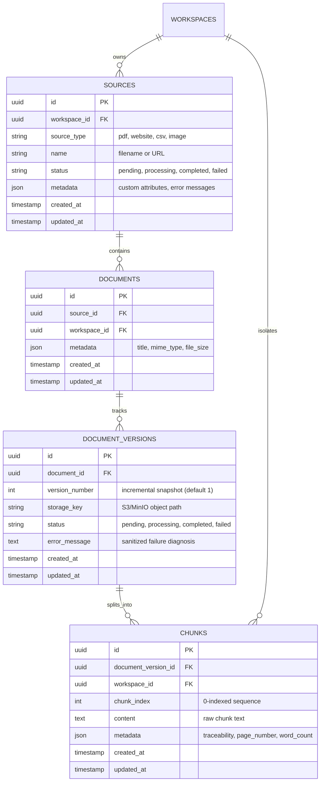

# IntelligenceOS: Phase 2 Knowledge Ingestion Pipeline Implementation Guide

Welcome to the **IntelligenceOS Phase 2 Implementation Guide**. This document provides an exhaustive, architectural, and operational walkthrough of the knowledge ingestion pipeline implemented in Phase 2. It is designed to give you a thorough understanding of the architecture, data models, processing flows, security controls, and design decisions so you can confidently build further advanced capabilities (such as hybrid RAG retrieval, agentic workflows, conversational memory, and evaluation) in future phases.

---

## 1. High-Level Architecture Overview

IntelligenceOS Phase 2 establishes the end-to-end, multi-tenant, asynchronous knowledge ingestion path:

```
[Client / API Request]
         │
         ▼
[1. Upload / URL Submission] ────► [2. Object Storage (MinIO / S3)]
         │                                (Stores raw binary file)
         ▼
[3. PostgreSQL Metadata State]
    - Source (PENDING)
    - Document
    - DocumentVersion (PENDING)
         │
         ▼
[4. Redis Background Queue] ─── (Job enqueued: LPUSH)
         │
         ▼ (Async Worker: BRPOP)
[5. Ingestion Worker Process]
    ├── Status -> PROCESSING
    ├── A. Content Retrieval (S3 download or safe HTTP fetch)
    ├── B. Parsing (PDF, CSV, Website with SSRF defense, Image OCR)
    ├── C. Internal Normalization (Canonical NormalizedDocument)
    ├── D. Deterministic Chunking (Sliding window + boundary detection)
    ├── E. Vector Embeddings (Gemini API or Mock Provider)
    ├── F. Vector Store (Qdrant with mandatory workspace_id payload)
    ├── G. Relational Chunks Persistence (PostgreSQL chunks table)
    └── H. Status -> COMPLETED (or FAILED with sanitized diagnostics)
```

### Architectural Principles

1. **Strict Multi-Tenant Workspace Isolation**: Every source, document, chunk, vector payload, and storage path is partitioned by `workspace_id`. Cross-workspace data leakage is prevented by design at the database foreign key level, the API authorization layer, and the vector database query/mutation filters.
2. **Asynchronous Non-Blocking Processing**: File uploads and URL submissions return `202 Accepted` immediately. Heavy I/O (file downloads, OCR, parsing, chunking, and embedding generation) is executed by the Redis-backed ingestion worker.
3. **Decoupled Object Storage**: Large binary files are never stored in PostgreSQL. Relational tables store storage keys and structured metadata; raw files reside in S3-compatible object storage (MinIO for local development).
4. **Normalized Internal Representation**: Downstream chunking and embedding logic are completely agnostic to input file formats. Parsers convert PDFs, web pages, CSVs, and images into a unified `NormalizedDocument` structure.
5. **Idempotent Ingestion & Safe Retries**: If an ingestion job fails or is retried, existing vector points in Qdrant and relational chunk records in PostgreSQL for that document version are purged before re-indexing. Vectors and metadata are never duplicated.
6. **Defense in Depth**: Untrusted files are sanitized; URL ingestion rigorously enforces DNS-level SSRF checks against internal, loopback, and cloud-metadata addresses (e.g. AWS/GCP `169.254.169.254`).

---

## 2. Relational Knowledge Schema (PostgreSQL)

The knowledge domain schema is managed via Alembic migrations (`alembic/versions/0002_knowledge_ingestion_schema.py`):



### Table Details & Constraints

- **`sources`**: Represents the input origin. Deleting a workspace cascades and removes all its sources.
- **`documents`**: Logical knowledge containers.
- **`document_versions`**: Immutable snapshots of documents. Holds the `storage_key` pointing to the object store.
- **`chunks`**: Textual segments ready for retrieval. Enforces a composite unique constraint: `(document_version_id, chunk_index)` to ensure sequence integrity.
- **Vectors in PostgreSQL**: Per architectural requirements, vector embeddings are **NOT** stored in PostgreSQL. They are stored exclusively in Qdrant.

---

## 3. Storage Abstraction Layer

Located in `app/storage/`:

- **`StorageBackend` (`base.py`)**: Abstract base class defining `upload_file`, `download_file`, `delete_file`, `file_exists`, and `health_check`.
- **`S3StorageBackend` (`s3.py`)**: Production-ready S3 and local MinIO adapter using `boto3`. Dispatches blocking I/O calls to `asyncio.to_thread` for non-blocking asynchronous event loop execution. Automatically ensures the bucket exists upon startup.
- **`LocalStorageBackend` (`local.py`)**: Filesystem-backed storage with strict directory containment validation (`is_relative_to`) to prevent directory traversal attacks (`../../etc/passwd`).
- **`MockStorageBackend` (`mock.py`)**: In-memory dictionary storage for fast, isolated unit tests.
- **Factory (`factory.py`)**: Resolves storage backend dynamically via `STORAGE_BACKEND` (`s3`, `local`, or `mock`).

Object key structure:
```
workspaces/{workspace_id}/sources/{source_id}/{sanitized_filename}
```

---

## 4. Supported Ingestion Parsers & Normalization

Located in `app/ingestion/`:

### Canonical Representation (`app/ingestion/models.py`)
All parsers output a `NormalizedDocument` consisting of ordered `NormalizedElement` items:
- `element_index`: 0, 1, 2...
- `text`: Cleaned text content.
- `page_number`: 1-indexed page number (when available, e.g. PDF or Image) or `None`.
- `metadata`: Origin-specific metadata (e.g. `row_index` for CSV, HTML tag for Website).

### Parsers (`app/ingestion/parsers/`)

1. **PDF Parser (`pdf.py`)**:
   - Uses `pypdf.PdfReader`.
   - Iterates page by page, extracting text and preserving `page_number = i + 1`.
   - Rejects encrypted/password-protected PDFs and corrupt streams with structured `ParserError`.
   - Detects empty/scanned PDFs and provides informative diagnostic messages.

2. **CSV Parser (`csv.py`)**:
   - Parses tabular data with automatic delimiter sniffing.
   - Formats each row into readable column-value pairs: `Col1: Val1 | Col2: Val2`.
   - Tracks `row_index` in element metadata.

3. **Website Parser with SSRF Protection (`website.py`)**:
   - **DNS-Level SSRF Prevention**:
     - Resolves destination hostname to all IP addresses via `socket.getaddrinfo`.
     - Rejects any address in private (`10.0.0.0/8`, `172.16.0.0/12`, `192.168.0.0/16`), loopback (`127.0.0.0/8`), link-local (`169.254.0.0/16` AWS/GCP instance metadata), multicast, or reserved ranges using Python's `ipaddress` module.
     - Blocks explicit cloud metadata hostnames (`metadata.google.internal`, `localhost`).
     - Inspects HTTP redirects and re-validates each redirect target against SSRF rules before following.
   - **HTML Content Extraction**:
     - Strips `<script>`, `<style>`, `<noscript>`, `<nav>`, `<header>`, `<footer>`, `<aside>`, `<form>`.
     - Extracts title and sequential blocks (`<h1>`-`<h6>`, `<p>`, `<li>`, `<blockquote>`).

4. **Image OCR Parser (`image.py`)**:
   - Protects against image decompression bombs (`Image.MAX_IMAGE_PIXELS = 50_000_000`).
   - Uses `PIL.Image` and `pytesseract.image_to_string` for Optical Character Recognition.
   - Formats recognized text into a single element with `page_number = 1` and resolution metadata.
   - Supports mock OCR text in test environments when Tesseract binary is not present on the host.

---

## 5. Deterministic Chunking

Located in `app/ingestion/chunking/`:

- **`DeterministicChunker` (`deterministic.py`)**:
  - Implements recursive character boundary splitting across separators: `["\n\n", "\n", ". ", "? ", "! ", "; ", ", ", " ", ""]`.
  - Configurable `chunk_size` (default: 1000 characters) and `chunk_overlap` (default: 150 characters).
  - Preserves underlying `page_number` from the corresponding `NormalizedElement`.
  - Assigns sequential `chunk_index` starting from 0.
  - Generates comprehensive traceability metadata for each chunk:
    - `workspace_id`
    - `source_id`
    - `document_id`
    - `document_version_id`
    - `chunk_index`
    - `page_number`
    - `source_type`
    - `document_title`
    - `char_count`
    - `word_count`

---

## 6. Embedding Provider Abstraction

Located in `app/providers/embedding/`:

- **`EmbeddingProvider` (`base.py`)**: Interface exposing `embed_texts(list[str])`, `embed_query(str)`, and `dimension`.
- **`GeminiEmbeddingProvider` (`gemini.py`)**: Uses Google GenAI SDK (`google-genai`) with model `text-embedding-004` (768 dimensions). Dispatches API calls to worker threadpools and maps downstream errors into domain exceptions (`EmbeddingAuthenticationError`, `EmbeddingRateLimitError`, `EmbeddingServiceUnavailableError`).
- **`MockEmbeddingProvider` (`mock.py`)**: Deterministically hashes input text into L2-normalized float vectors of length 768. Fast, offline, reproducible, and zero-cost for automated testing.
- **Factory (`factory.py`)**: Configured via `EMBEDDING_PROVIDER` environment variable (`gemini` or `mock`).

---

## 7. Qdrant Vector Storage

Located in `app/vectorstore/`:

- **`VectorStore` (`base.py`)**: Abstract base class requiring `workspace_id: UUID` on all mutation and query operations.
- **`QdrantVectorStore` (`qdrant.py`)**:
  - Connects via `AsyncQdrantClient`.
  - Automatically provisions the `intelligenceos_chunks` collection with Cosine distance metric and matching vector dimensionality (768).
  - Creates keyword payload indices on `workspace_id`, `source_id`, and `document_version_id` for lightning-fast filtered deletions and retrieval.
  - **Enforced Workspace Isolation**: Validates `payload["workspace_id"] == str(workspace_id)` for every upserted point. Deletions always apply a composite filter with `FieldCondition(key="workspace_id", match=MatchValue(value=str(workspace_id)))`.
- **`MockVectorStore` (`mock.py`)**: In-memory nested dictionary store (`_storage[workspace_id][point_id]`) used in test suites.

---

## 8. Background Processing & Queue

Located in `app/queue/` and `app/worker.py`:

- **`RedisJobQueue` (`job_queue.py`)**: Uses Redis `LPUSH` and `BRPOP` for reliable FIFO background job distribution.
- **Ingestion Worker (`app/worker.py`)**: Standalone background worker process. Can be launched as a dedicated service in Docker (`python -m app.worker`) or executed directly.
- **Ingestion Pipeline Flow**:
  1. `Source.status = PROCESSING`, `DocumentVersion.status = PROCESSING`.
  2. Raw content retrieved from S3 or URL.
  3. Content parsed into `NormalizedDocument`.
  4. Document chunked into `list[ChunkData]`.
  5. Chunks embedded into vector arrays.
  6. Existing vectors for this `document_version_id` purged in Qdrant; new vectors upserted.
  7. Existing `Chunk` rows purged in PostgreSQL; new rows persisted.
  8. `Source.status = COMPLETED`, `DocumentVersion.status = COMPLETED`.
  9. On error: status set to `FAILED`, sanitized error message stored in `version.error_message` and `source.metadata_["error"]`.

---

## 9. API Specification

All endpoints are mounted under `/api/v1/workspaces/{workspace_id}/sources`:

| Method | Endpoint | Description | Status Code | Required Role |
|---|---|---|---|---|
| `POST` | `/upload` | Upload a binary file (PDF, CSV, PNG, JPG, WEBP, TIFF) | `202 Accepted` | Member, Admin, Owner |
| `POST` | `/url` | Submit a public website URL with SSRF checks | `202 Accepted` | Member, Admin, Owner |
| `GET` | `/` | List all sources in workspace (paginated) | `200 OK` | Member, Admin, Owner |
| `GET` | `/{source_id}` | Get source details and ingestion status | `200 OK` | Member, Admin, Owner |
| `GET` | `/{source_id}/documents` | List documents & versions for a source | `200 OK` | Member, Admin, Owner |
| `GET` | `/{source_id}/chunks` | Inspect text chunks & traceability metadata | `200 OK` | Member, Admin, Owner |
| `POST` | `/{source_id}/retry` | Re-enqueue a failed or pending source | `202 Accepted` | Admin, Owner |

### Example Request / Response

#### 1. Uploading a File Source
`POST /api/v1/workspaces/3fa85f64-5717-4562-b3fc-2c963f66afa6/sources/upload`
```http
Authorization: Bearer <jwt_token>
Content-Type: multipart/form-data

file: architecture.pdf
```
**Response (202 Accepted):**
```json
{
  "id": "e4b52b2e-6d42-4b2a-a9f8-7b9612345678",
  "workspace_id": "3fa85f64-5717-4562-b3fc-2c963f66afa6",
  "source_type": "pdf",
  "name": "architecture.pdf",
  "status": "pending",
  "metadata": {
    "original_filename": "architecture.pdf",
    "file_size": 245120,
    "content_type": "application/pdf"
  },
  "created_at": "2026-10-04T17:00:00Z",
  "updated_at": "2026-10-04T17:00:00Z"
}
```

#### 2. Polling Source Status
`GET /api/v1/workspaces/3fa85f64-5717-4562-b3fc-2c963f66afa6/sources/e4b52b2e-6d42-4b2a-a9f8-7b9612345678`
**Response (200 OK):**
```json
{
  "id": "e4b52b2e-6d42-4b2a-a9f8-7b9612345678",
  "workspace_id": "3fa85f64-5717-4562-b3fc-2c963f66afa6",
  "source_type": "pdf",
  "name": "architecture.pdf",
  "status": "completed",
  "metadata": {
    "original_filename": "architecture.pdf",
    "file_size": 245120,
    "content_type": "application/pdf",
    "total_chunks": 18,
    "title": "IntelligenceOS System Architecture"
  },
  "created_at": "2026-10-04T17:00:00Z",
  "updated_at": "2026-10-04T17:00:04Z"
}
```

#### 3. Inspecting Chunks
`GET /api/v1/workspaces/3fa85f64-5717-4562-b3fc-2c963f66afa6/sources/e4b52b2e-6d42-4b2a-a9f8-7b9612345678/chunks`
**Response (200 OK):**
```json
[
  {
    "id": "f1234567-89ab-cdef-0123-456789abcdef",
    "document_version_id": "d9876543-210f-edcb-a987-6543210fedcb",
    "workspace_id": "3fa85f64-5717-4562-b3fc-2c963f66afa6",
    "chunk_index": 0,
    "content": "IntelligenceOS Architecture Overview: Phase 2 Ingestion Pipeline...",
    "metadata": {
      "workspace_id": "3fa85f64-5717-4562-b3fc-2c963f66afa6",
      "source_id": "e4b52b2e-6d42-4b2a-a9f8-7b9612345678",
      "source_type": "pdf",
      "page_number": 1,
      "char_count": 842,
      "word_count": 128
    },
    "created_at": "2026-10-04T17:00:03Z",
    "updated_at": "2026-10-04T17:00:03Z"
  }
]
```

---

## 10. Local Docker Infrastructure

The updated `docker-compose.yml` provides all required services:
- **`postgres`**: Port 5432 (PostgreSQL 16)
- **`redis`**: Port 6379 (Redis 7)
- **`qdrant`**: Port 6333 (REST/UI) and 6334 (gRPC)
- **`minio`**: Port 9000 (S3 API) and 9001 (Web Console)
- **`api`**: Port 8000 (FastAPI HTTP Server)
- **`worker`**: Background Ingestion Worker (`python -m app.worker`)

To start the full environment:
```bash
docker compose up -d
```

---

## 11. Verification and Testing

The test suite covers every layer of Phase 2:
- `tests/test_storage.py`: S3/MinIO, Local, and Mock storage operations; path traversal rejection.
- `tests/test_parsers.py`: PDF, CSV, Website HTML parsing, Image OCR, SSRF rejection.
- `tests/test_chunking.py`: Deterministic chunking, sliding overlap, page preservation, traceability.
- `tests/test_embedding_provider.py`: Mock and Gemini embeddings, vector normalization, error mapping.
- `tests/test_vector_store.py`: Qdrant and Mock vector stores, workspace filtering, deletion, point counts.
- `tests/test_ingestion_pipeline.py`: End-to-end ingestion pipeline, status transitions, failure handling, retry idempotency.
- `tests/test_sources_api.py`: FastAPI endpoints, file uploads, URL submission, listing, chunks, workspace isolation.

To run the complete test suite:
```bash
pytest
```
To run linter checks:
```bash
ruff check .
```

---

## 12. Preparing for Phase 3: What's Next?

Phase 2 deliberately restricted scope to knowledge ingestion. You now have a solid, production-grade foundation for Phase 3. Here is how future phases build directly upon this pipeline:

1. **RAG Retrieval Engine**:
   - Query embedding using `get_embedding_provider().embed_query(query)`.
   - Vector similarity search in Qdrant filtered by `workspace_id`.
   - Hybrid lexical search (BM25 or PostgreSQL Full Text Search) combined with vector search.
2. **Re-ranking**:
   - Re-rank top candidates using a cross-encoder model before sending context to LLMs.
3. **Conversations & Agent Memory**:
   - Multi-turn conversation sessions tied to workspaces.
   - Autonomous agents synthesizing answers from retrieved chunk context with precise citations (linking back to `source_id`, `document_id`, and `page_number`).
